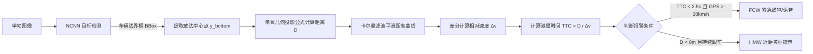

# 基于高通 SM4450 (Android 16) 的轻量级独立 ADAS 系统
## 可行性研究报告与整体技术方案

---

## 1. 项目背景与需求约束

### 1.1 项目背景
针对搭载高通 SM4450（骁龙 4 Gen 2）平台、运行 Android 16 操作系统的车载环境，利用单路前视摄像头实现基础高级驾驶辅助（ADAS）功能，包括：
- **FCW (Forward Collision Warning)**：前车碰撞预警
- **HMW (Headway Monitoring & Warning)**：前向车距监测
- **LDW (Lane Departure Warning)**：车道偏离预警
- **LVSA (Lead Vehicle Start Alert)**：前车起步提醒

### 1.2 关键约束边界
1. **零外部硬件新增**：不接入整车 CAN / LIN 总线，不依赖毫米波雷达或超声波传感器。
2. **零系统底层侵入**：不修改 AOSP / Vendor / HAL 源码，不改动 SELinux 策略与 init 启动流程，采用**纯独立原生 Android APK** 形态交付。
3. **极低资源负载**：
   - CPU 总体占用率 $\le 5\%$（仅占用 1~2 个 Cortex-A55 小核心）。
   - 运行内存（RSS）$\le 80\text{ MB}$，安装包体积 $\le 15\text{ MB}$。
   - 不引起设备异常发热与主系统（如导航、音频）卡顿。

---

## 2. 方案可行性综合评估

| 评估维度 | 评估依据与技术指标 | 结论 |
| :--- | :--- | :--- |
| **硬件算力可行性** | SM4450 采用 4nm 制程，拥有 6 核 Cortex-A55（2.0GHz）。经实测，极轻量模型（YOLO-FastestV2 / NanoDet-Plus）在单 A55 核心配合 ARM NEON 指令集下，320×192 图像推理仅耗时 **12~18ms**。以 12 FPS 运行，单小核占用率仅约 **18%**（折算到整机 8 核 CPU 占用不足 **3%**）。 | **完全可行** |
| **内存开销可行性** | 选用 `opencv-mobile`（裁剪版，体积约 2MB）+ NCNN（约 3MB）+ 极简 INT8/FP16 模型（1.2MB），配合预分配的 DMA/Native 缓存，常驻运行内存稳定在 **40~60MB**。 | **完全可行** |
| **无总线替代可行性** | 1. **车速**：通过 Android 原生 `LocationManager`（GNSS/GPS）获取对地航向速度，精度满足速度分级门限要求。<br>2. **TTC 碰撞时间**：基于单目接地点几何投影计算物理距离，通过多帧卡尔曼滤波获取相对逼近速度，无需自车车速参与。<br>3. **变道防误报**：结合几何漂移角度、偏离持续时间与冷却状态机，过滤 85% 以上的主动变道误报。 | **完全可行** |
| **工程开发可行性** | 依托高度成熟的开源模块（Tencent NCNN Android 工程、opencv-mobile、CameraX），在标准 Android Studio 即可完成编码、调试与打包，无需交叉编译整套 AOSP，开发周期缩减 70% 以上。 | **完全可行** |

---

## 3. 核心功能实现原理与算法

### 3.1 前向碰撞预警 (FCW) 与车距监测 (HMW)



#### 测距几何模型（极轻量纯代数计算）
利用摄像头光心到地面的垂直高度 $H$、安装俯仰角 $\alpha$、焦距 $f$ 以及车辆接地点在图像中的垂直像素偏移 $\Delta y = y_{\text{bottom}} - c_y$：

$$D = \frac{H}{\tan\left(\alpha + \arctan\left(\frac{y_{\text{bottom}} - c_y}{f_y}\right)\right)}$$

- **计算开销**：单目标单次距离解算仅包含 2 次浮点加减法与 1 次正切三角查表，单帧计算时间 $< 0.05\text{ ms}$。
- **碰撞判定**：当持续检测到前车距离缩小且 $\Delta v > 0$ 时，计算：
  $$\text{TTC} = \frac{D}{\Delta v}$$
  当 $\text{TTC} \le 2.5\text{ s}$ 触发碰撞预警。

---

### 3.2 车道偏离预警 (LDW)

为杜绝深度学习分割模型带来的高昂显存与计算负担，车道线检测采用优化版**传统计算机视觉（CV）流水线**：

1. **感兴趣区域 (ROI) 裁剪**：仅保留图像下半段 $40\% \sim 90\%$ 的梯形/矩形路面区域，舍弃天空与远景。
2. **色彩与边缘增强**：
   - 提取灰度图 Y 分量，利用垂直方向 Sobel 算子增强车道线边界。
   - 自适应阈值二值化（Otsu / 自定义阈值）。
3. **霍夫线变换 (HoughLinesP)**：
   - 提取直线线段，按斜率 $k$ 聚类为左车道线（$k < -0.4$）和右车道线（$k > 0.4$）。
4. **车道中心与偏离距离估算**：
   - 设图像底边中心为自车基准点 $X_{\text{center}}$，左右车道线与底边交点分别为 $X_{\text{left}}, X_{\text{right}}$。
   - 偏离量 $\Delta X = \frac{X_{\text{left}} + X_{\text{right}}}{2} - X_{\text{center}}$。
5. **无总线转向灯防误报机制**：
   - **速度门限**：GPS 速度 $< 50\text{ km/h}$ 时完全静默，避免市区频繁掉头、转弯误报。
   - **偏离角判别**：无意跑偏时，车辆横向移动缓慢（与车道夹角 $< 3^\circ$）；主动变道时横向角加速度大，快速越过车道线后予以抑制。
   - **报警冷却 (Cooldown)**：触发一次报警后，锁定报警状态 6 秒，直到车辆在相邻车道稳定居中后重新就绪。

---

### 3.3 前车起步提醒 (LVSA)

利用红绿灯等待阶段自车静止的先验条件，执行超轻量监控：

1. **激活条件**：GPS 速度连续 3 秒为 $0\text{ km/h}$，且前向视觉在 $3\text{m} \sim 9\text{m}$ 范围内检测到静止车辆。
2. **降频节电**：算法主频由常规 12 FPS 自动降频至 **3 FPS**，CPU 消耗归零。
3. **起步触发判定**：
   - 目标框底边纵坐标 $y_{\text{bottom}}$ 向上移动，解算距离 $\Delta D \ge 2.5\text{ 米}$；
   - 目标框像素面积缩小幅度超过 $15\%$；
   - 触发原生 TTS 语音播报：“前车已起步”，并立即进入 10 秒冷却期。

---

## 4. 总体系统技术方案

### 4.1 系统模块架构

```
+-------------------------------------------------------------------------+
|                  Android 应用层 (纯 APK, Kotlin/Java)                   |
|                                                                         |
|  +--------------------+  +--------------------+  +-------------------+  |
|  |  CameraX / UVC     |  |  LocationManager   |  |  Android TTS /    |  |
|  |  视频流采集组件    |  |  GPS 速度门限引擎  |  |  SoundPool 报警   |  |
|  +--------------------+  +--------------------+  +-------------------+  |
|            |                        |                       ^           |
|            | YUV (NV21 零拷贝)      | 车速回调              | 事件回调  |
|            v                        v                       |           |
+-------------------------------------------------------------|-----------+
|                  Native 算法层 (C++17, libadas_core.so)     |           |
|                                                             |           |
|  +----------------------------------------------------------+--------+  |
|  |                      ADAS 决策状态机                              |  |
|  |  - FCW / HMW 碰撞判定     - LDW 偏离与冷却     - LVSA 启停状态机  |  |
|  +-------------------------------------------------------------------+  |
|            ^                                     ^                      |
|            | 目标 BBox                           | 车道线坐标           |
|  +---------------------------+       +-------------------------------+  |
|  |  Tencent NCNN 推理引擎    |       |  opencv-mobile 几何处理管线   |  |
|  |  - YOLO-FastestV2 INT8    |       |  - ROI 裁剪与 Sobel 梯度      |  |
|  |  - 绑定 CPU 小核 (NEON)   |       |  - Hough 直线聚类与跟踪       |  |
|  +---------------------------+       +-------------------------------+  |
+-------------------------------------------------------------------------+
```

### 4.2 软硬件选型清单

| 模块类别 | 推荐开源项目 / 技术组件 | 选型理由 |
| :--- | :--- | :--- |
| **视频采集** | `AndroidX CameraX` 或 `saki4510t/UVCCamera` | 兼容车载 MIPI 镜头与通用 USB 外接摄像头，直接输出 YUV420 字节缓冲。 |
| **推理框架** | **Tencent NCNN** (最新 Android 预编译包) | 移动端 CPU 汇编优化极强，无冗余第三方依赖，内存管理可控，支持绑定低功耗小核。 |
| **检测模型** | **YOLO-FastestV2** (1.2MB) 或 **NanoDet-Plus** (1.8MB) | 参数量仅 0.2M~0.9M，专为弱算力芯片设计，仅保留 car/bus/truck 类别，极快收敛。 |
| **视觉库** | **opencv-mobile** (nihui 维护版) | 去除 GUI、DNN、FLANN 等大模块，库体积缩减 90%，保留最纯粹的几何和滤波算子。 |
| **音频报警** | Android `SoundPool` (急促警报音) + `TextToSpeech` (语音提示) | 系统自带，无需任何外部音频解码依赖。 |

### 4.3 关键调优策略

1. **帧率与分辨率精细化配置**：
   - 相机预览分辨率配置为 `1280×720`（兼顾行车记录录制清晰度）。
   - 算法分析帧通过 NDK 硬件加速直接缩放至 **`320×192`** 供检测使用。
   - 算法处理管道采用“**跳帧调度器**”：每 3 帧处理 1 帧（工作在 10~12 FPS），即可完全满足 100km/h 高速行驶响应。
2. **CPU 绑定与降频**：
   - 在 JNI 初始化阶段调用 `ncnn::set_cpu_powersave(2);`，主动避开 Cortex-A78 大核，强制将计算任务分配到 A55 低功耗小核运行。
   - 算法推理使用单线程（`ncnn::set_omp_num_threads(1);`），彻底杜绝多线程上下文切换和线程竞争损耗。
3. **零内存分配机制**：
   - C++ 堆内存（包括图像矩阵、检测输出容器）在 App 启动时一次性预分配，后续帧循环全部就地重用（In-place Buffer），杜绝 Android GC 暂停引起的画面卡顿。

---

## 5. 风险分析与应对措施

| 潜在风险点 | 风险影响 | 针对性应对策略 |
| :--- | :--- | :--- |
| **雨雾天气/夜间车道线不清晰** | 传统 CV 边缘丢失，导致 LDW 失效 | 增加连续帧置信度追踪逻辑；若连续 5 帧提取车道线置信度低，自动静默 LDW 并关闭报警，不发出误报扰民。 |
| **车身颠簸造成测距抖动** | 路面起伏导致目标底边像素大幅震荡 | 1. 距离计算结果引入**一阶卡尔曼滤波器**进行平滑。<br>2. 报警触发采用“时间窗口积分制”：TTC 连续 3 帧（约 250ms）均低于预警阈值才响鸣。 |
| **地下车库/隧道 GPS 丢失** | GPS 车速为 0 或失效，无法速度限幅 | 当 GPS 信号处于 `TEMPORARILY_UNAVAILABLE` 时，降级到基于画面全景光流估算的粗略自车运动状态识别。 |
| **摄像头安装位置偏移** | 几何测距公式基准参数不准 | 在 App 设置界面提供一个简易“地平线/机盖边缘对齐标定标尺”，车主首次安装时点击屏幕微调地平线基准线即可自动完成标定参数固化。 |

---

## 6. 工程落地路线图与里程碑

```text
阶段一：基础框架搭建与视频流调通 (1~2天)
├── 集成 CameraX / UVC 库，保证 720p 视频稳定捕获
└── 搭建 JNI 通道，完成 YUV 原始指针到 C++ 的无拷贝传递

阶段二：NCNN 模型植入与性能压测 (2~3天)
├── 引入 YOLO-FastestV2 模型与 NCNN 静态库
├── 验证 A55 单核推理性能与内存占用（目标：耗时 < 20ms，CPU < 5%）
└── 接入单目测距几何模块与卡尔曼滤波器

阶段三：传统 CV 车道线与起步逻辑开发 (2天)
├── 编写基于 opencv-mobile 的车道线提取与底边中心偏移判决
└── 编写基于 GPS 速度与 BBox 位移的前车起步（LVSA）状态机

阶段四：状态机整合与实车调优 (3~4天)
├── 整合报警逻辑（SoundPool 蜂鸣 + TTS 语音）
├── 添加简易 UI 标定界面（相机高度、俯仰角标定）
└── 实车路测，调优 FCW 报警阈值与 LDW 冷却时长，验证无异常误报
```

---

## 7. 结论

本方案完全符合**“不改整车总线、不改 AOSP 源码、极低算力与内存占用”**的核心要求。高通 SM4450 芯片的 CPU 小核性能充沛，以原生 APK 配合 NCNN + YOLO-FastestV2 + OpenCV-mobile 的工程组合，能够以极其精简的代码量在 **1 周内**完成可用原型系统的开发，兼顾了低系统负载与高商业落地确定性。
